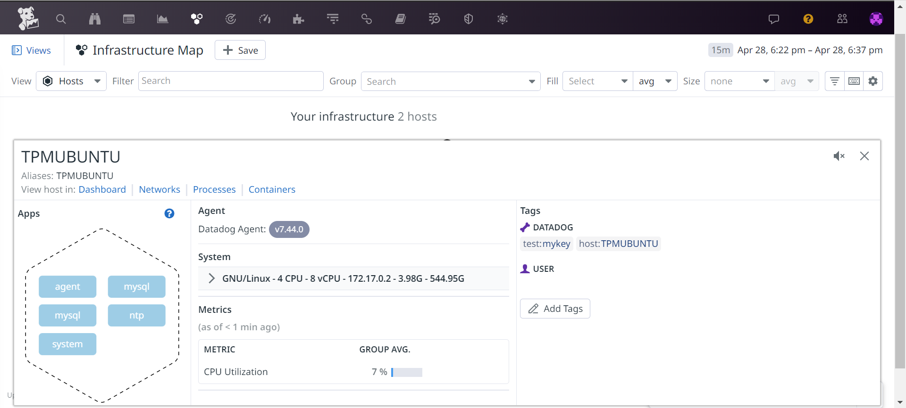
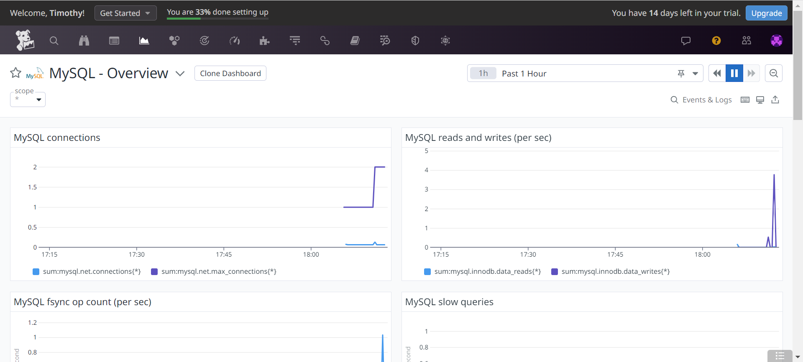
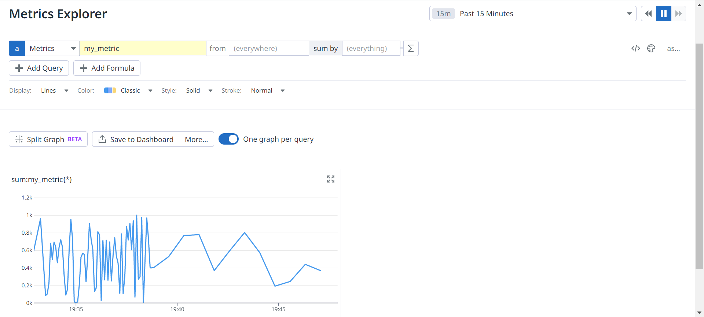
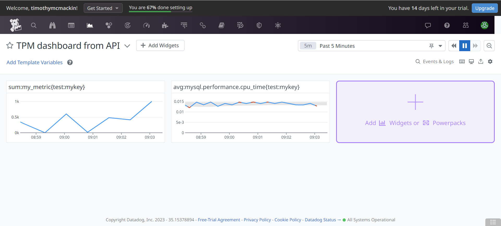
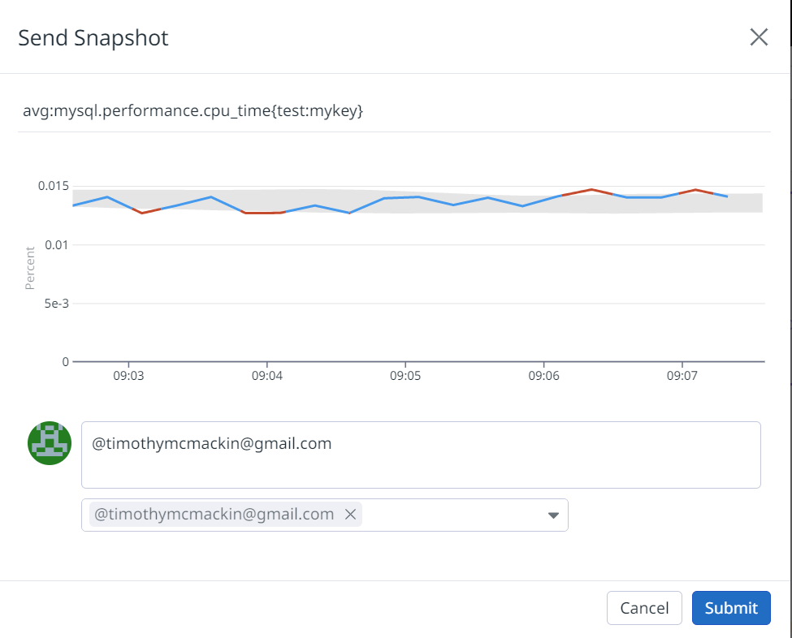
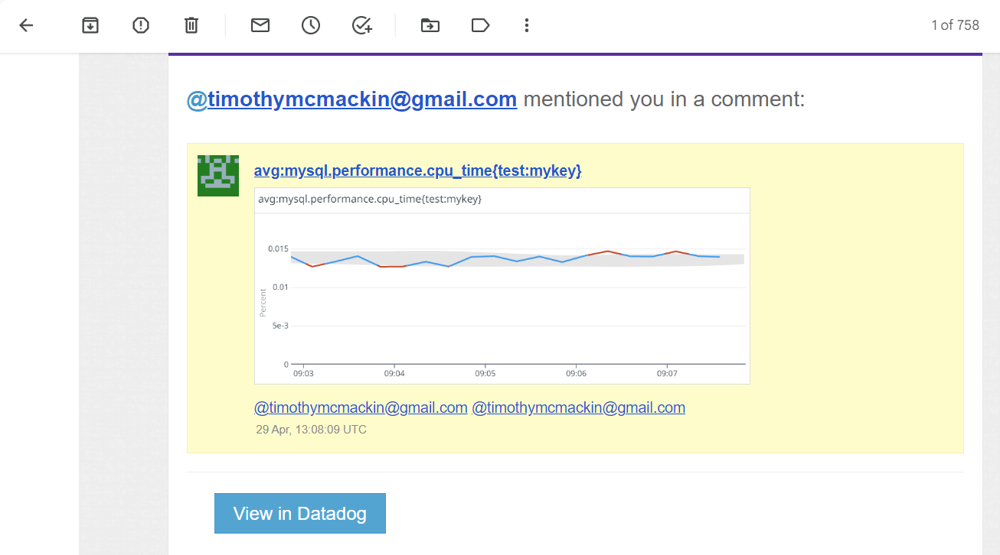

## Exercise 1: Collecting Metrics

1. I started an Ubuntu container and installed the DataDog agent on it.
This screenshot shows the host on the Host Map page in DataDog with the custom tag `test:mykey`:

   

2. I installed MySQL on the container and set up the DataDog database integration as described in the docs.

   Here's my configuration file (`/etc/datadog-agent/conf.d/mysql.d/conf.yaml`) for the DataDog MySQL integration:

   ```yaml
   init_config: false

   instances:
     - host: 127.0.0.1
       username: datadog
       password: 'datadog' # from the CREATE USER step earlier
       port: "3306" # e.g. 3306
       options:
         replication: false
         galera_cluster: true
         extra_status_metrics: true
         extra_innodb_metrics: true
         extra_performance_metrics: true
         schema_size_metrics: false
         disable_innodb_metrics: false
   ```

   Here is the database integration dashboard while I ran a few database queries to show some activity:

   

3. I set up a custom Agent check that submits a metric named "my_metric."
Here are its files:

   `/etc/datadog-agent/checks.d/my_metric.py`

   ```python
   # the following try/except block will make the custom check compatible with any Agent version
   try:
       # first, try to import the base class from new versions of the Agent...
       from datadog_checks.base import AgentCheck
       import random
   except ImportError:
       # ...if the above failed, the check is running in Agent version < 6.6.0
       from checks import AgentCheck

   # content of the special variable __version__ will be shown in the Agent status page
   __version__ = "1.0.0"

   class HelloCheck(AgentCheck):
       def check(self, instance):
           self.gauge('my_metric', random.randint(0, 1000), tags=['myTags:testvalue'] + self.instance.get('tags', []))
   ```

   `/etc/datadog-agent/conf.d/my_metric.yaml`

   ```yaml
   instances: [{}]
   ```

4. To illustrate the change in the interval, I ran the check at 5 seconds for a while and then switched to 45 seconds.
The change is apparent in the frequency of points in the line graph, as in this screenshot of the Metrics Explorer page:

   

5. Per the [Custom Agent Check](https://docs.datadoghq.com/developers/write_agent_check/?tab=agentv6v7#collection-interval) help topic I can set the interval for the check without changing the `py` check file by setting the `min_collection_interval` parameter in the `/etc/datadog-agent/conf.d/my_metric.yaml` config file.

   After I set the check to run every 45 seconds, the config file looked like this:

   ```yaml
   init_config:

   instances:
     - min_collection_interval: 45
   ```

## Exercise 2: Visualizing Data

1. I created a dashboard with the API that includes the two specified metrics with this TypeScript program: [./src/createDashboard.ts](./src/createDashboard.ts).

2. I opened the new dashboard in DataDog and set the interval to 5 minutes.
Here's a public link to the dashboard: [TPM dashboard from API](https://p.datadoghq.com/sb/b29db77a-e607-11ed-afa9-da7ad0900002-299d46299d6e7903ef021516e24dd7da?from_ts=1682878324461&to_ts=1682881924461&live=true).

   Here's a screenshot of the dashboard:

   


3. I selected the MySQL CPU metric with the anomalies function applied and sent myself a snapshot with the @ notation:

   

   Here's what the snapshot looks like in my email:

   

4. The graph of the MySQL server CPU usage with the anomalies function applied shows the expected range for the CPU usage and highlights times when the usage goes out of that range.
The algorithm in the anomalies function predicts this safe range based on historical data.
For more information about anomalies and algorithms, see the docs for the [`anomalies()`](https://docs.datadoghq.com/dashboards/functions/algorithms/#anomalies) function.

## Exercise 3: Getting Started

